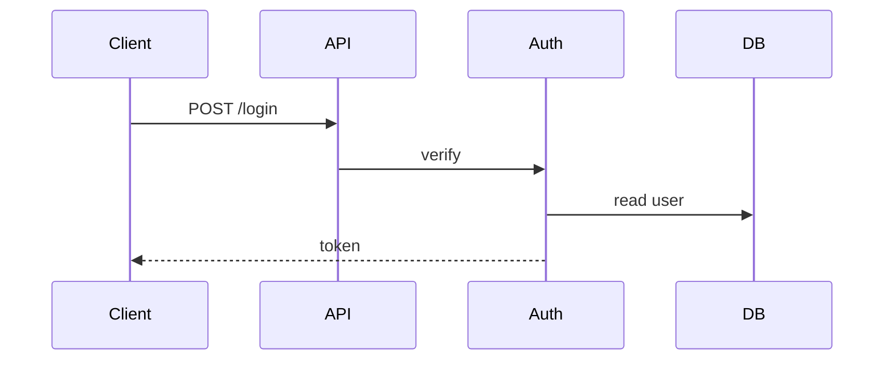

Purpose: 给“真实目标长相”的示例，最大化信息密度并降低跑偏。
When to read: 写作前快速浏览；写完后对照纠偏（长度、重复率、锚点引用方式）。
Inputs: 无（示例自包含）。
Outputs: 对目标产物的直觉：该短到什么程度、哪些内容放哪一节、如何引用锚点。
Do NOT: 不要把示例当模板逐字替换；只学结构与密度，不复制内容。

# Output Example（示意）

> 说明：这是“目标风格示例”，展示密度与分工；不要求逐字照抄。

---
Doc-ID: QA-YYYY-MM-DD-001
Doc-Type: qa
Owner: repo-reader
Date: YYYY-MM-DD
Version: v1.0
Status: draft
Source: <user prompt>
Activated-Skills: repo-reader

## Summary
- 这是一个 backend service，入口是 `cmd/api/main.go`，核心模块是 `auth`/`orders`/`storage`
- 标准 Mode：模块卡 Top 6，Key Flows 2 条，Q&A 8 条
- 关键依赖：Postgres、Redis、第三方支付 API

## Assumptions
- None

## Open Questions
- None

## Next Steps
- 可选：生成 Extension Guide 或对 `auth` 做 Module Mini-Doc

## Question
如何快速理解这个 repo 的结构与关键流程？

## Answer

### Repo Map

#### Entry Points
- `cmd/api/main.go`：启动 HTTP API server
- `cmd/worker/main.go`：启动后台任务 worker

#### Directory Notes（≤12 行）
- `internal/auth/`：鉴权与权限
- `internal/orders/`：订单业务域
- `internal/storage/`：存储适配器（db/cache）
- `configs/`：环境配置模板
- `.github/workflows/`：CI

### Architecture Story

#### Modules（Top 6）
- Name: auth
  Responsibility: 登录/鉴权/权限检查
  Entry / Touchpoints: middleware / token verify
  Key Files: internal/auth/middleware.go, internal/auth/service.go
  Depends On: storage, config
  Exposes To: api handlers

### Key Flows

#### Flow 1: Login

- Happy Path: 认证 → 生成 token → 返回
- Failure Points: 用户不存在 / 密码错误 / DB 不可用

### Q&A（引用而非复述）

- Question：鉴权逻辑在哪？
  Answer：主要在 `auth` 模块的 middleware + service；见 “Modules > auth”，以及 “Key Flows > Login”。

--- End Example ---

