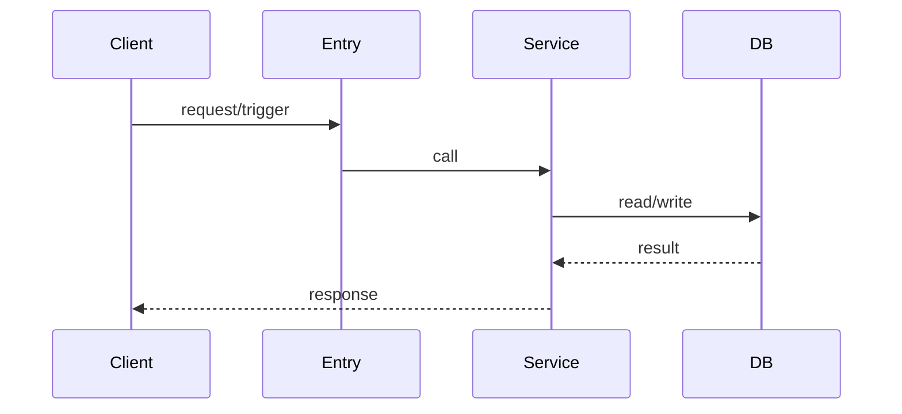

Purpose: Key Flows 输出模板（Mermaid + 极简解释），集中承载流程叙事，供其它章节引用。
When to read: 阶段 2/3；标准/深入模式必读，轻量模式按需读。
Inputs: Pass2 的流程候选；入口点；关键模块卡；外部依赖。
Outputs: Key Flows 章节（Flow 1..N），每条含 Mermaid + 5 行内解释 + 失败路径提示。
Do NOT: 不要在 Repo Map/Architecture/Q&A 里重复讲流程细节；其它章节只引用这里的 Flow 名称/锚点。

# Key Flows（模板）

输出数量（按 Mode）：

- 轻量：1 条主流程 + 1 条依赖/调用链替代
- 标准：2 条
- 深入：3–5 条

每条 Flow 的固定结构（短句为主）：

## Flow <n>: <name>

- Trigger：
- Happy Path（3–6 步）：
- Data Stores / External：
- Failure Points（2–3 条）：
- Observability（log/metric/trace，如果有）：

依赖/调用链替代（轻量模式用）：

- 从入口点到核心函数的 5–10 个节点链路（路径/符号名即可），并说明“这是流程不足 2 条时的替代交付物”

